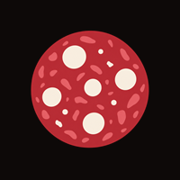
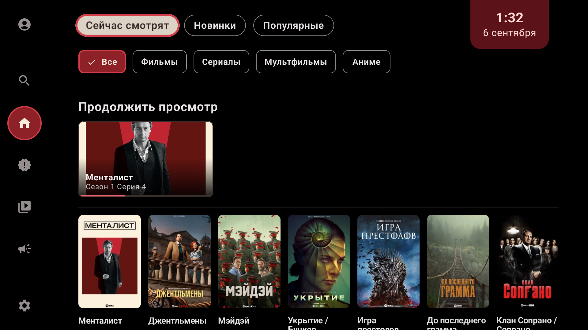
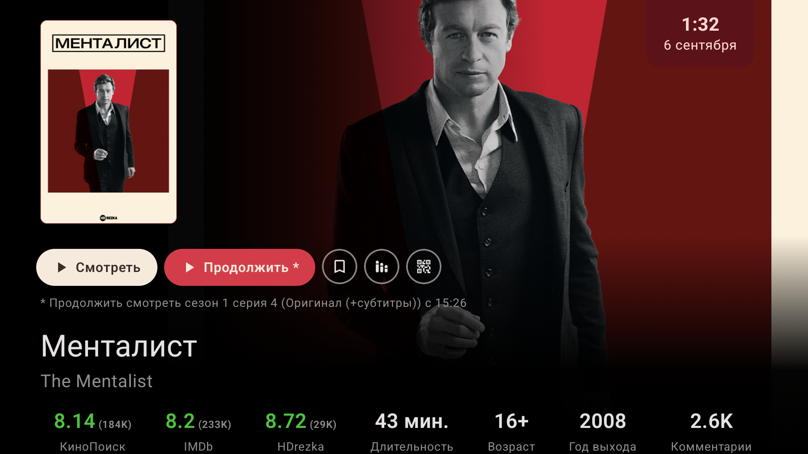
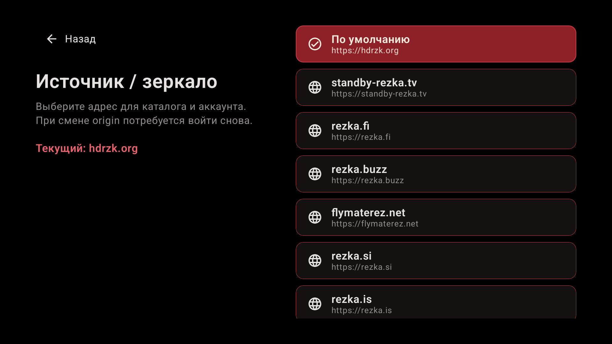
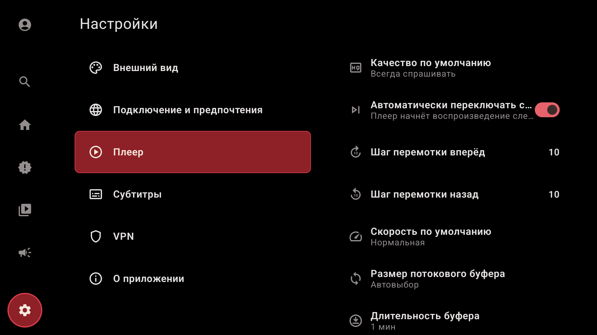
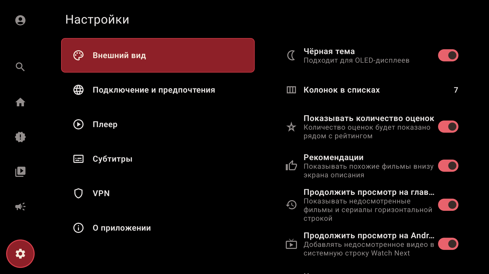

  

<h1 align="center">NArezka TV</h1>

Неофициальный клиент HDrezka для Android TV и ТВ-приставок.

<strong>Android 7.0+</strong> · Управление пультом · Русский интерфейс

  <a href="https://github.com/4erdenko/narezka-tv-releases/releases/latest"><strong>Скачать APK</strong></a>
  · <a href="https://t.me/app_narezka_tv"><strong>Telegram-канал</strong></a>
  · <a href="https://4pda.to/forum/index.php?showtopic=1126006">Обсуждение на 4PDA</a>
  · <a href="https://github.com/4erdenko/narezka-tv-releases/releases">История версий</a>

## Сохранение и продолжение просмотра

- **Серия и время сохраняются автоматически** — каждые 5 секунд, при паузе, перемотке, выходе из плеера и уходе приложения в фон. Также запоминаются озвучка, качество и субтитры.
- **«Продолжить просмотр» на главной** показывает сезон, серию и полосу прогресса. Карточка запускает продолжение; в описании фильма или сериала видны сохранённая позиция и озвучка.
- **Продолжение с запасом в 5 секунд.** Смена качества не сбрасывает позицию. Завершённые фильмы и серии убираются с полки продолжения.
- **Синхронизация прогресса между устройствами** с NArezka TV под одним аккаунтом HDrezka. При сбое сети позиция остаётся на устройстве и отправляется позже. История разных аккаунтов хранится отдельно.
- **Watch Next** на совместимых Android TV и Google TV: продолжение доступно и на главном экране телевизора. Системная строка и полка внутри приложения включаются отдельно.

Точное сохранение позиции работает во встроенном плеере. Внешние плееры не возвращают своё время просмотра. Для облачной синхронизации нужен интернет; с другими приложениями HDrezka она не связана.

## Зеркала, каталог и плеер

| Возможность | Что доступно |
| --- | --- |
| Выбор источника | 14 встроенных адресов, включая адрес по умолчанию, и своё HTTPS-зеркало |
| Проверка зеркала | Выбор и проверка доступности до входа в аккаунт; после входа — в настройках |
| Каталог | Новинки, популярное, коллекции, анонсы, фильтры и рекомендации |
| Поиск | Подсказки, история и голосовой ввод при наличии службы распознавания |
| Аккаунт | Закладки и обновления сериалов HDrezka |
| Видео | Озвучки, субтитры, качество до 4K при наличии у источника |
| Воспроизведение | Скорость 0,25–2×, настройка перемотки и буфера, переход к следующей серии, внешний плеер |
| Оформление | Чёрная тема, число колонок, размер и расположение субтитров |

Зеркало меняется вручную; после смены потребуется войти заново. Доступность каталога и видео зависит от сети, источника и аккаунта.

<strong>Скриншоты: продолжение, зеркала и настройки</strong>

### Карточка с сохранённой серией и временем

### Выбор зеркала

### Настройки плеера

### Оформление и полки продолжения

Снимки сделаны в версии 0.1.0. В последующих версиях отдельные элементы интерфейса могут отличаться.

## Установка и обновление

1. Откройте [последний релиз](https://github.com/4erdenko/narezka-tv-releases/releases/latest) и скачайте **narezka-tv-release.apk** из раздела **Assets**.
2. Перенесите APK на телевизор или приставку и откройте его.
3. Если Android запросит разрешение на установку, разрешите её для приложения, через которое открываете файл, и подтвердите установку.

Root не нужен. NArezka TV устанавливается рядом с HDrezka TV. Обновляйте поверх установленной версии, чтобы сохранить локальные данные.

Начиная с версии 0.1.1, при включённой проверке обновлений приложение само проверяет новые версии и скачивает APK. Установку нужно подтвердить в системном окне. Для перехода с 0.1.0 установите APK вручную.

<strong>Если появляется предупреждение Google Play Protect</strong>

При установке APK вне Google Play защита Google может предложить проверку приложения. Дождитесь её результата. Если установка блокируется или приложение помечено как опасное, приложите точный текст предупреждения к сообщению об ошибке — причину нельзя определить только по факту установки APK.

[Справка Google о Play Защите](https://support.google.com/googleplay/answer/2812853?hl=ru).

## Обратная связь

Ошибки и предложения собираются [в теме приложения на 4PDA](https://4pda.to/forum/index.php?showtopic=1126006).

В сообщении укажите модель устройства, версию Android и NArezka TV, используемый плеер, действия и результат. Для ошибок продолжения добавьте сезон, серию и время остановки; для проблем установки — текст предупреждения или снимок экрана. Пароли и данные сессии не публикуйте.

## О проекте

| | |
| --- | --- |
| Разработчик | [4erdenko](https://github.com/4erdenko) |
| Имя пакета | `dev.narezkatv.app` |
| Платформа | Android TV / Google TV, Android 7.0 и выше |
| Содержимое репозитория | Готовые APK, описания релизов и материалы приложения |

Исходный код не публикуется. NArezka TV — самостоятельное приложение; HDrezka TV 1.4.0 от AstroApps использовалось как ориентир поведения. Проект не связан с администрацией HDrezka.

